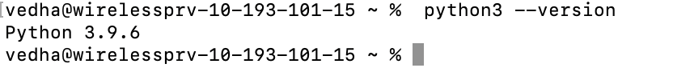
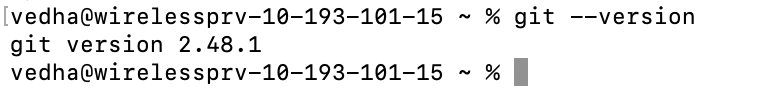
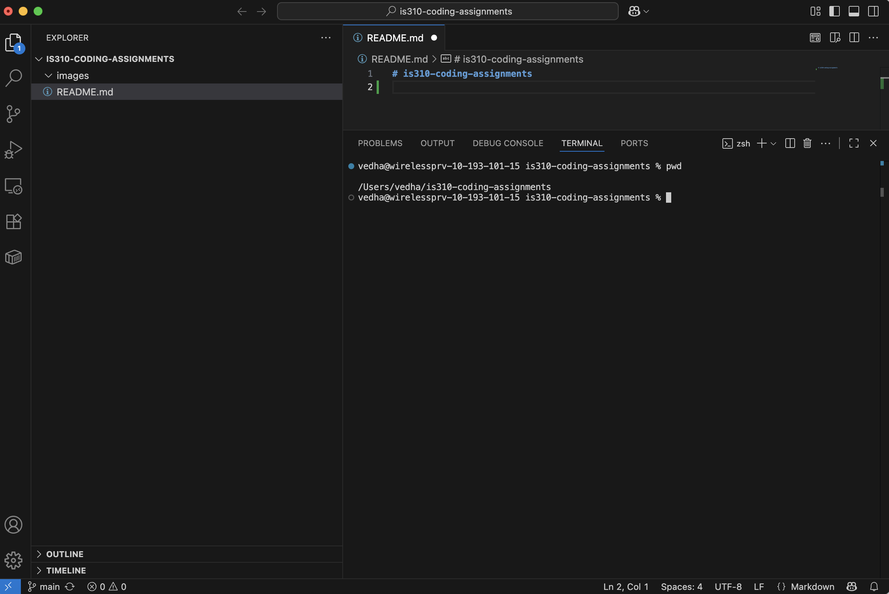

# Init IS310 Homework

## Proof of Installation

Hypothes.is Username: vedhapant

1. Python

2. Git

3. VS Code

4. AI Tool/Workflow

I plan to use Claude for this course to help with coding questions and debugging.