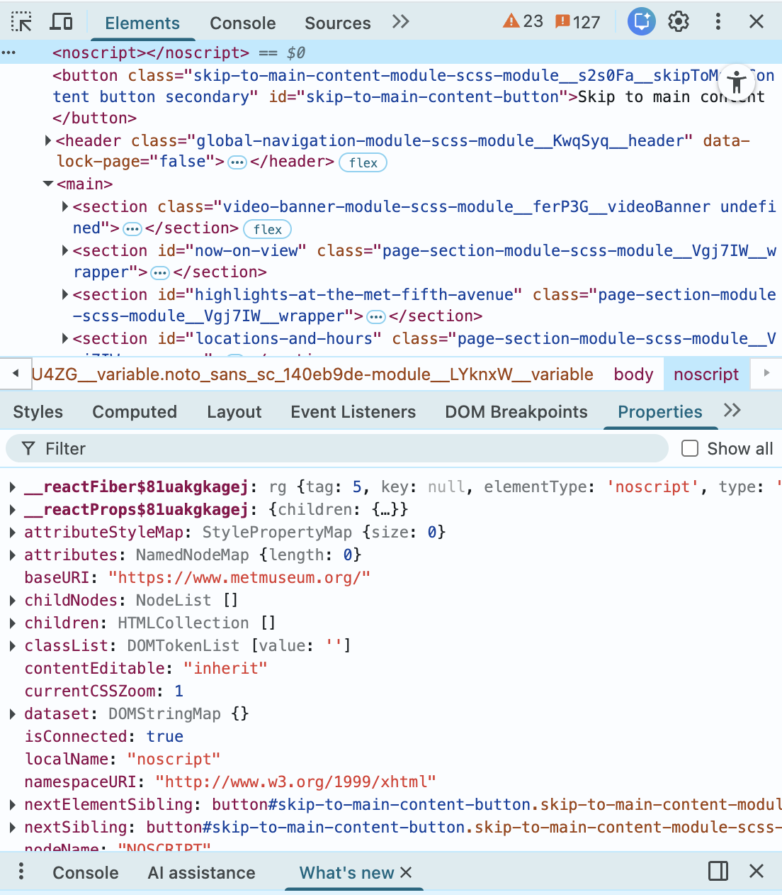

# Source and Style Assignment

## Assignment 1: Inspecting the Cultural Web

**Website I chose:** [The Metropolitan Museum of Art Digital Collection](https://www.metmuseum.org/art/collection)

**What web technologies were used?**

When I right-clicked on the Met's website and selected "Inspect," I could see the following in the Elements panel:

- **HTML** – The page is built with standard HTML elements like `<header>`, `<main>`, `<section>`, `<button>`, and `<noscript>`. I could see sections with IDs like `now-on-view`, `highlights-at-the-met-fifth-avenue`, and `locations-and-hours`, which means the page is structured with semantic HTML.

- **CSS (via SCSS modules)** – Instead of plain `.css` files, the Met uses **CSS Modules compiled from SCSS**. I could tell because the class names look like `global-navigation-module-scss-module__KwqSyq__header` and `page-section-module-scss-module__Vgj7IW__wrapper` — that long scrambled format is a telltale sign of CSS Modules, which is a modern way of writing styles so they don't accidentally interfere with each other.

- **JavaScript (React)** – In the Properties panel, I could see references to `__reactFiber$81uakgkagej` and `__reactProps$81uakgkagej`. These are internal React properties that only appear when a website is built using **React**, a popular JavaScript framework made by Meta. This means the Met's website is a React application — content is loaded and updated dynamically using JavaScript rather than just static HTML pages.

**Who built it?**

The Metropolitan Museum of Art has an internal digital team that built and maintains the website. The `baseURI` visible in the inspector confirms the site is hosted at `https://www.metmuseum.org/`. The Met also has a public GitHub organization at [https://github.com/metmuseum](https://github.com/metmuseum), where they have open-sourced their collection data. Their open access repository has multiple contributors, indicating a team of developers rather than a single person. The use of React and SCSS modules also suggests a professional, multi-person engineering team, as these are tools typically used in larger collaborative development environments.

**Screenshot of my inspection:**

---

## Assignment 2: Styling the Cultural Web

I created an `index.html` file that presents one digitized cultural object from the Metropolitan Museum of Art's collection, relevant to our group's focus on American history and my specific interest in American art history. The object I chose is *Watson and the Shark* by John Singleton Copley (1778). View the finalized page if you like using this link: https://htmlpreview.github.io/?https://github.com/vedhapant/is310-coding-assignments/blob/main/source-and-style/index.html 
